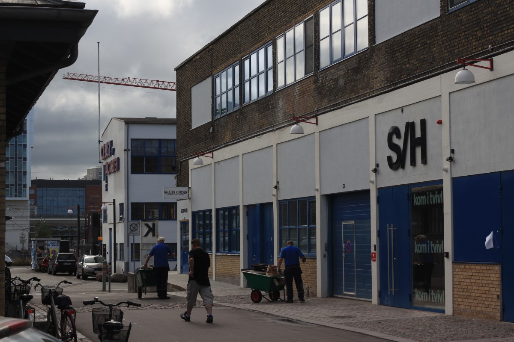

# Infrastructure walk

## Format

The infrastructure walk takes us through different sites near the Techfestival event area, that can inspire and structure themed discussion amongst the participants. The walk is narrative and each location is chosen to provide a backdrop and locality for a particular discussion theme.

The participants are divided in groups of 3-4. The small'ish group size makes room for even participation. Each group should have a mix of backgrounds and experiences. We are going to talk a lot, so sharing different perspectives makes the most rewarding walk/talk experience.

Each group should have a narrator and recorders. The job of the narrator is to read the text and questions for the group at each location. The job of the recorders is to record discussions and observations on paper, pictures and perhaps sound.

The stops on the route are described in the zine. Each have a topical title, a text and 3 questions. The text and questions are read on arrival by the narrator, and the questions are discussed among the participants during the walk to the next location.

The experiences of the groups are shared in plenum after the walk ends.

# Route

### Sort/Hvid venue (black waypoint)

__Title:__ Seeing the invisible

__Text:__

__Questions:__
- one
- two
- tree

__Notes:__ The venue for the summit is theatre Sort/Hvid <small>_[en: Black/White]_</small>. It's located in Kødbyen <small>_[en-litteral: Meatcity (lol), en: Meatpacker district]_</small>, the main area where the Techfestival venues are located.

<video src="media/meatpacker.mp4" controls width="320" height="240">
<a href="media/meatpacker.mp4">Download video</a>
</video> <small>From Halmtorvet to Sort/Hvid</small>

 <small>Sort/Hvid</small>

 <small>Looking towards the traintracks from S/H</small>

### Dybbøls bridge/IKEA construction site (Blue waypoint)

__Title:__ Sizing up clouds

__Text:__ The physicality and scale of the datacenters that make out the cloud eludes our imagination. Looking around you see the IKEA build site, the Fisketorvet mall and the Nexus CPH bulding complex. Large areas by (danish) urban standards, but comparable in size to the the multiple new datacenters being build in rural Denmark.

__Questions:__
- one
- two
- tree

__Notes:__
- Apple DK-Viborg datacenter floor area 166.000 m2
- Facebook DK-Odense datacenter floor area 55.000 m2
- Fisketorvet total floor area 58,000 m2
- Nexus CPH floor area 41.000 m2 (https://molio.dk/bygnet/nyhed/article/ugens-projekt-nexus-cph/)
- IKEA ground area 24.700 m2
- IKEA floor area (3 stories) 37.000 m2 (https://www.licitationen.dk/project/view/192/ikea_dybbolsbro)

 <small>Digsite at the kødbyen end of Dybbøls bridge</small>

 <small>Looking towards the venue from Dybbøls bridge</small>

 <small>IKEA construction site (24.700 m2)</small>

### Fisketorvet mall (Orange waypoint)

__Title:__ Moving through the frontend

__Text:__ The mall is an interface to technology and consumer goods disassociated creation, supply chains and environmental impacts.

__Questions:__
- one
- two
- tree

__Notes:__
I kinda want to use the mall. It's by far the nicest route to go through it. And i think it would make an interesting frame for discussion.

 <small>Fisketorvet mall</small>

 <small>Telco shop</small>

 <small>Apple shop</small>

 <small>Fisketorvet foodcourt & back exit</small>

### H. C. Ørsted Power Station (Crimson waypoint)

__Title:__ Old power

__Text:__ TBD

__Questions:__
- one
- two
- tree

__Notes:__
Power output: 185 MW

The power station switched from coal to natual gas in 1994. Today Ørsted (former DONG energy *not kidding*) is a major importer of natual gas from Gazprom. The gas is not really needed to fulfill danish energy needs, so the company resells the gas to european countries. Energy is basically international politics.
https://en.wikipedia.org/wiki/H._C._%C3%98rsted_Power_Station
http://www.gazpromexport.ru/en/partners/denmark/

 <small>HCØ powerplant from Dybbøls bridge</small>

 <small>DieselHouse ¯\_(ツ)_/¯</small>

 <small>HCØ info plaque</small>

 <small>HCØ path</small>

 <small>HCØ up close</small>

### Guldminen (Gold waypoint)

__Title:__ Toxic rocks

__Text:__ Yo

__Questions:__
- one
- two
- tree

__Notes:__
http://www.guldminenkbh.dk/

Guldminen at the Vasbygade recycling station <small>[en: The goldmine]</small> describe itself as:

> "A laboratory for developing new ways to recycle, upcycle, repair, redesign and distribute what gets delivered to the Vasbygade recycling station. Through various projects we work to expand, inspire and innovate ways to reuse resources to increase product life and product life. By sorting / delivering your waste at Vasbygade Genbrugsstation, your waste can be part of Guldminen's work for direct use and resource reconsideration".

 <small>Guldminen recycling</small>

 <small>Guldminen entrance</small>

 <small>Guldminen upcycling container</small>

 <small>Electronic waste</small>

 <small>More electronic waste (there is always a CRT)</small>

### Flydende by/Floating city (Light blue waypoint)

__Title:__ TBD

__Text:__ TBD

__Questions:__
- one
- two
- tree

__Notes:__
http://flydendeby.org/

https://www.workaway.info/18131323734d-en.html

https://www.facebook.com/flydendeby

> "The goal of Flydende By is to build up a sustainable society from below. We develop methods to create decentralised sustainable solutions out of reused and organic ressources. We want to find ways of organizing work, economy and decision processes in a fair and socially sustainable way. We want to find ways of using the ocean in a senseful and constructive way, as part of the future sustainable society. We know that all these aims can not be reached at once, or by us alone. Flydende By is an association that you can be a part of, if you want to work for transition into a sustainable society. Together we can do it."

 <small>Floating city sign</small>

 <small>Floating city sign detail 1</small>

 <small>Floating city sign detail 2</small>

 <small>¿Windmill toiletgarden?</small>

 <small>Pissoir</small>

 <small>Everything for free shop</small>

 <small>Repair station</small>

 <small>Tall bike</small>

 <small>Upstairs area</small>

 <small>Repair station</small>

### Transformer station (gray waypoint)

__Title:__ TBD

__Text:__ TBD

__Questions:__
- one
- two
- tree

__Notes:__
This is a transformation station on the way back to S/H. It's a nice potential stop on the route.

 <small>Powergrid obelisk</small>

 <small>Electric shock hazard!</small>

 <small>Antenna "KH G4S INTERNET"</small>

